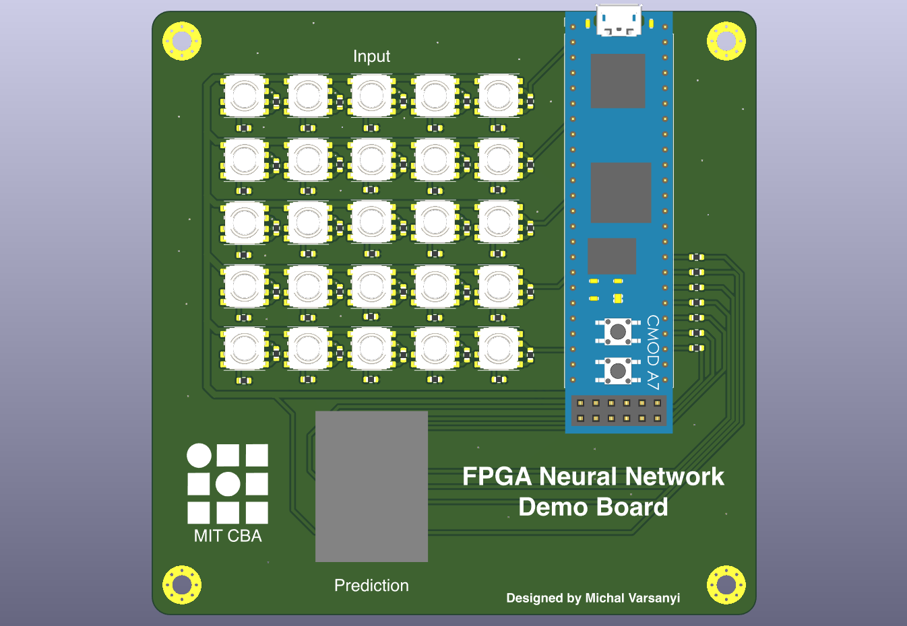

# FPGA-NN-Demo

### **⚠️ This project is not final and is still in the development phase ⚠️**

This is a small demo board showing how to compile neural networks (NN) on Xilinx/AMD FPGAs using the hls4ml framework. The board features a 5x5 grid of buttons, where the user can draw a numeral, which gets passed to the fully-connected NN running on the FPGA. Based on the input, the NN infers what numeral the user drew and displays it on the 7-segment display visible at the bottom of the PCB.

